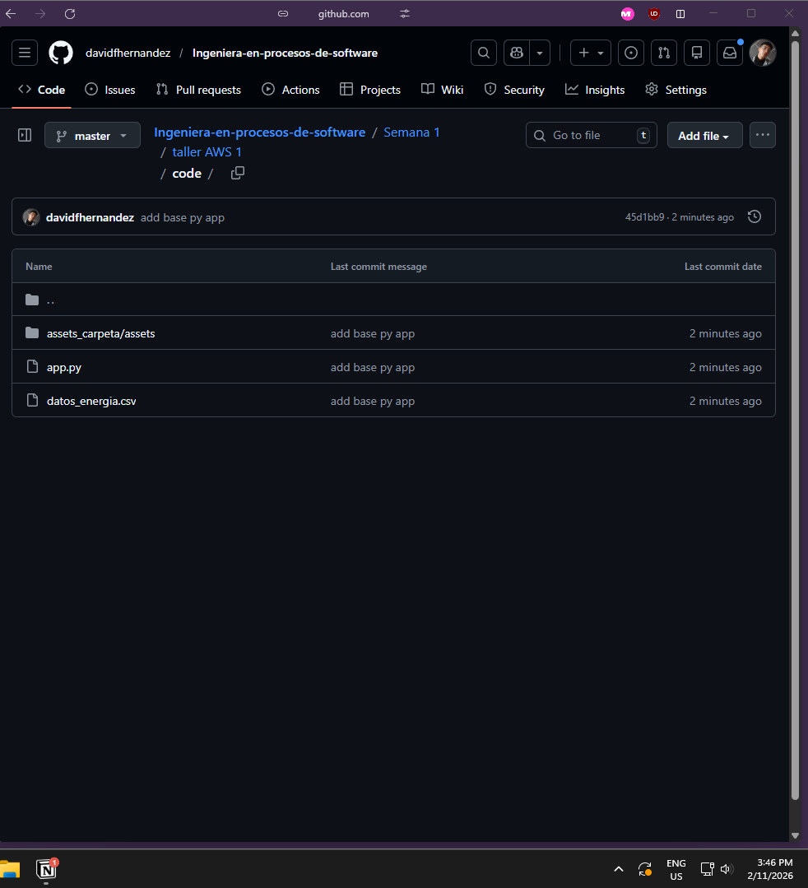
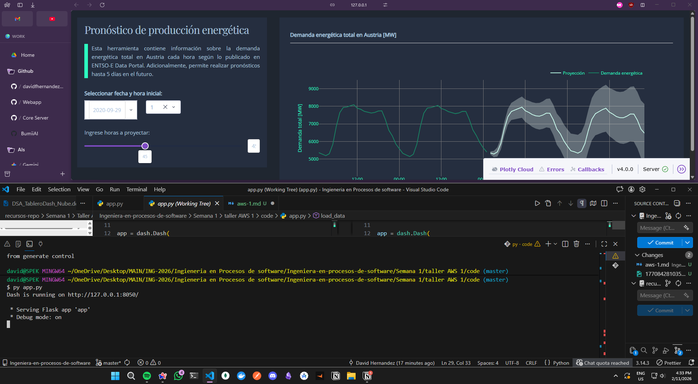
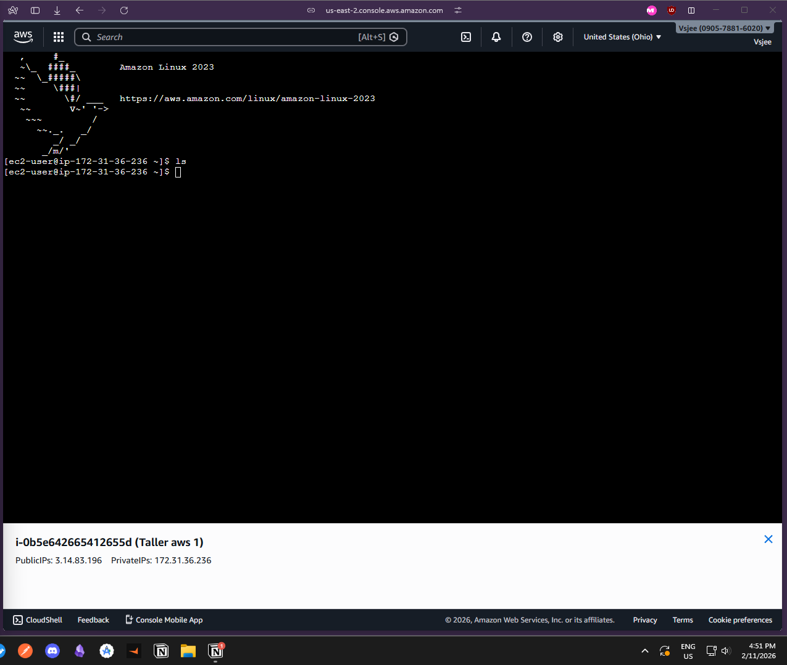
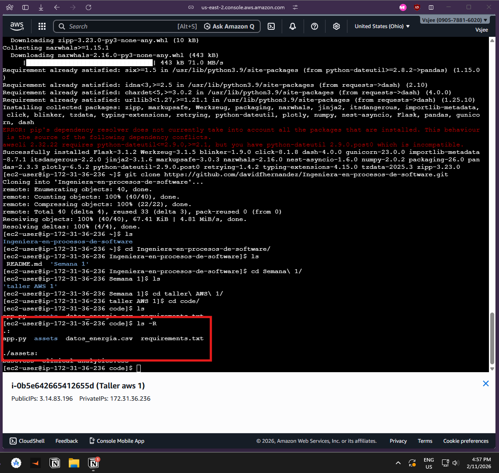
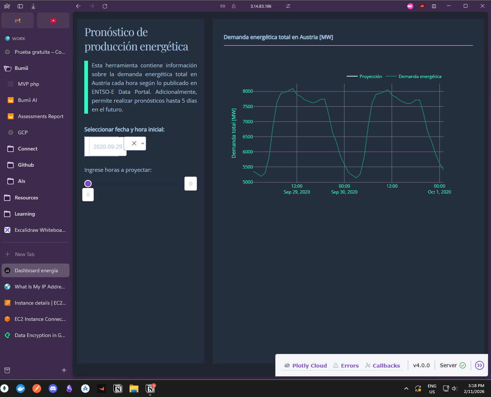
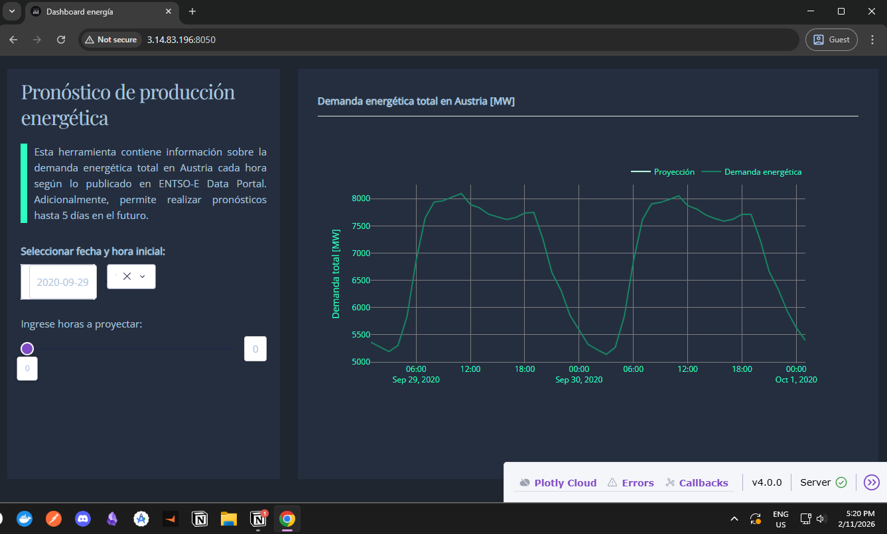

### Entrega taller AWS 1 - EC2

Este taller consta de crear un repositorio nuevo en GitHub, instalar las herramientas necesarias (`git`, `python`, `vscode`), clonar el [Repositorio base](https://github.com/BrayanTorres2/ingenieria-procesos-software) y preparar el código (app en Python), el cual se deberá subir a una instancia de `EC2` en **AWS** para acceder mediante su dirección `IP`.

#### 1. Instalación y Configuración Local
* Descargar e instalar [Git](https://git-scm.com/downloads).
* Crear una carpeta local e inicializar Git:
    ```bash
    git init
    git config --global user.name "tu-usuario"
    git config --global user.email "tu-email"

    git config --global init.defaultBranch main
    ```
* Agregar los archivos base (`app.py`, `datos_energia.csv`, carpeta `assets`) a la carpeta.
* Realizar el primer commit (`git add .` y `git commit`).

#### 2. Lógica del Tablero (App.py)
* Modificar `app.py`: Completar la función `load_data()` para cargar el CSV como DataFrame, asegurando que la fecha sea índice y tipo datetime.
* Probar localmente instalando librerías y ejecutando `python app.py`. Verificar en `localhost`.

#### 3. Repositorio GitHub (Remoto)
* Crear un repositorio público vacío en GitHub.
* Vincular local con remoto y subir cambios (requiere **Personal Access Token** como contraseña):
    ```bash
    git remote add origin URL_DEL_REPO
    git push origin master
    ```
> 📸 **SCREENSHOT 1 (Reporte):** Captura del repositorio en GitHub con los archivos cargados. Incluir también el enlace del repositorio.



[Repositorio](https://github.com/davidfhernandez/Ingeniera-en-procesos-de-software)


App python corriendo en local

#### 4. AWS: Creación y Configuración de Instancia
* Lanzar instancia EC2 (Amazon Linux).
* Conectarse vía SSH.
> 📸 **SCREENSHOT 2 (Reporte):** Captura de la terminal conectada exitosamente a la máquina virtual.



* **Instalar dependencias en la VM:**
    ```bash
    sudo yum update -y
    sudo yum install python3-pip git -y
    pip3 install pandas dash gunicorn
    ```
* **Clonar repositorio:**
    ```bash
    git clone URL_DEL_REPO
    ```
> 📸 **SCREENSHOT 3 (Reporte):** Ejecuta el comando `ls -R` o entra a la carpeta clonada y toma captura mostrando los archivos en la VM.



#### 5. Despliegue y Ejecución
* **Modificar `app.py` en la VM:**
    * Usar `nano app.py`.
    * Cambiar la línea final a: `app.run_server(host="0.0.0.0", debug=True)`.
    * Guardar y subir este cambio al repo remoto (`git add`, `commit`, `push`).
* **Configurar Seguridad AWS:**
    * Ir a "Security Groups" de la instancia -> "Inbound Rules".
    * Agregar regla: **Custom TCP**, Port **8050**, Source **Anywhere (0.0.0.0/0)**.
* **Ejecutar:**
    ```bash
    python3 app.py
    ```
* Acceder desde el navegador: `http://IP_V4_VM:8050`.

> 📸 **SCREENSHOT 4 (Reporte):** Captura del tablero funcionando en el navegador con la IP pública visible. Incluir el link.



http://3.14.83.196:8050/

Validando la coneccion desde otro navegador con la `URL` visible.

